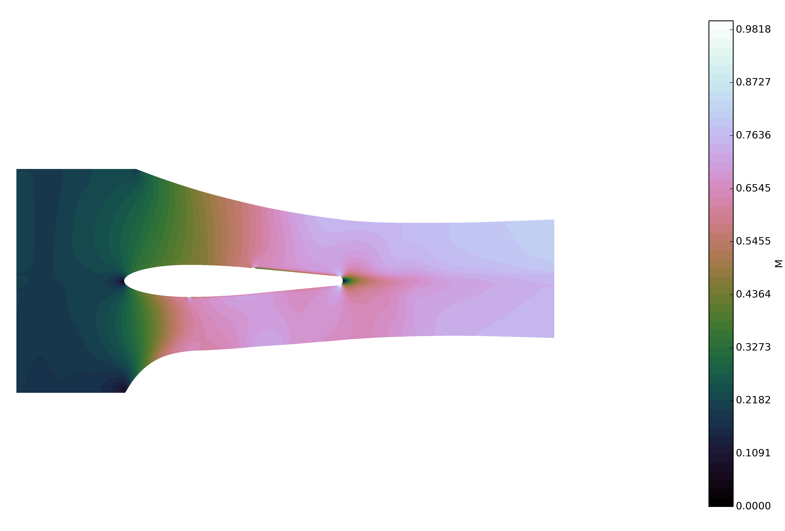

# Flowent
## Overview
Flowent is a program that solves the [Euler equations](https://en.wikipedia.org/wiki/Euler_equations_(fluid_dynamics)) of fluid dynamics for an arbitrary geometry and in compressible flow. It is a structured, multi-block solver that is second order accurate in both space and time.

The [finite volume method](https://en.wikipedia.org/wiki/Finite_volume_method) is used for spatial accuracy and the [Adams-Bashforth](https://en.wikipedia.org/wiki/Linear_multistep_method#Two-step_Adams%E2%80%93Bashforth) method is used for time-stepping. 

## Input
Input is supplied via three files: xxx.grid, xxx.patch and solnparams.flwntparam. These files specify the grid, grid patching (connectivity, inlet and outlet planes) and solution calculation parameters respectively. 

## Test cases
Four test cases are supplied, these take the form of:
1. Gaussian bump - a simple channel with a bump on the lower wall.
2. NACA-2412 - a NACA airfoil.
3. Wedge - a supersonic wedge in a channel.
4. Nash - a geometry from an experimental rig.

## Output
The data is output into a text file. The primary flow variables can be used to analyse the converged flow solution. An example of the output from a run of test case 4 is shown below.
